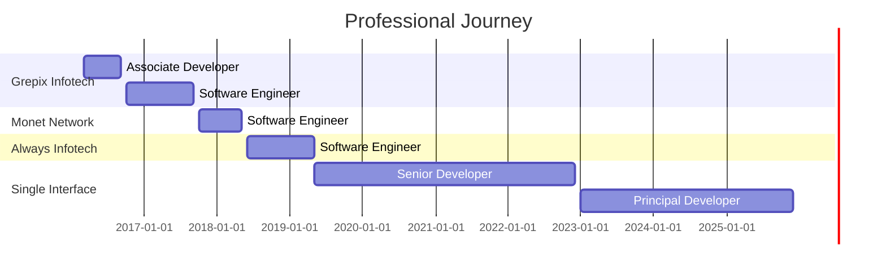

<div align="center">
  
</div>

<h3 align="center">🚀 Architect | Innovator | Problem Solver</h3>

<p align="center">
  <a href="https://www.linkedin.com/in/yourprofile"></a>
  <a href="mailto:iampawanyd@gmail.com"></a>
  <a href="https://yourportfolio.com"></a>
</p>

---

## 👨‍💻 About Me
```yaml
name: Pawan Kumar
role: Principal Software Developer
experience: 9+ Years
location: Gurugram, Haryana, India
current_company: Single Interface
specialization: 
  - Enterprise SaaS Architecture
  - High-Performance Systems
  - AI/ML Integration
  - Google Ecosystem
passion: Building scalable solutions that empower millions
philosophy: "Code is poetry, architecture is art, and impact is everything"
```

🔭 Currently leading transformative projects in **AI-powered automation** and **microservices architecture**

🌱 Exploring advanced **distributed systems**, **serverless architectures**, and **MLOps**

💡 Reduced client onboarding from **2 months to 2 hours** (99% improvement) with no-code solutions

⚡ Built systems serving **millions of concurrent users** with minimal latency

🎯 Passionate about **democratizing technology** and empowering non-technical users

---

## 🛠️ Tech Stack

### **Languages**


### **Frameworks & Libraries**


### **Databases**


### **Cloud & DevOps**


### **Google Ecosystem**


### **AI/ML & Advanced**


---

## 🏆 Key Achievements
```javascript
const achievements = {
  clientOnboarding: "99% reduction (2 months → 2 hours)",
  developmentSpeed: "70% faster with AI integration",
  systemScale: "Millions of concurrent users",
  architectureTransformation: "Monolithic → Microservices",
  userEmpowerment: "No-code solutions for non-technical teams",
  enterpriseSolutions: {
    stockMarketPlatform: "Real-time trading for millions",
    emotionDetection: "AI-powered analytics for Marvel & Big Brother",
    validationModule: "Zero-code validation configuration"
  }
};
```

---

## 💼 Featured Projects

### 🚗 **Taxi Booking Platform**
> Complete ride-sharing solution with real-time tracking and analytics
- **Tech:** PHP, CakePHP, MySQL, Redis, JWT
- **Features:** Geolocation matching, Payment integration, Driver analytics
- **Impact:** Full-featured MVP deployed successfully

### 🎭 **Emotion Detection Platform**
> AI-powered viewer response analysis for entertainment industry
- **Tech:** Python, WebRTC, Face Detection APIs, Computer Vision
- **Clients:** Marvel Studios, Big Brother
- **Impact:** Data-driven insights for content optimization

### 📊 **Stock Market Trading Platform**
> Enterprise-level real-time trading system
- **Tech:** PHP, MySQL, AWS, Redis
- **Scale:** Millions of concurrent users
- **Architecture:** LLD/HLD, High-availability design

### 🎨 **No-Code Website Builder**
> Revolutionary drag-and-drop platform
- **Tech:** JavaScript, Component Architecture, SaaS
- **Impact:** 99% reduction in onboarding time
- **Innovation:** Democratized website creation

### 🤖 **AI-Powered Component Generator**
> Intelligent automated design system
- **Tech:** AI/ML, NLP, Design Automation
- **Impact:** 70% faster development cycles
- **Innovation:** Context-aware component generation

### ✅ **Custom Validation Module**
> No-code validation configuration system
- **Tech:** Python, Uvicorn, MongoDB
- **Impact:** Zero developer dependency for validation changes
- **Innovation:** UI-based rule management

### 🔗 **Universal Lead Management**
> Dynamic CRM integration platform
- **Tech:** RESTful APIs, Webhook Management
- **Features:** Multi-form support, Third-party CRM integration
- **Impact:** Simplified lead capture across platforms

### 📈 **Global Event Tracking System**
> Comprehensive analytics infrastructure
- **Tech:** Google Tag Manager, Google Analytics
- **Features:** Custom events, Real-time dashboards
- **Impact:** Actionable engagement insights

---

## 📊 GitHub Stats

<div align="center">
  
  
</div>

<div align="center">
  
</div>

---

## 🎯 Expertise Areas

<table>
  <tr>
    <td valign="top" width="33%">
      
### 🏗️ Architecture
- System Design (LLD/HLD)
- Microservices Architecture
- Event-Driven Architecture
- Scalable SaaS Design
- High-Availability Systems
- Performance Optimization
      
    </td>
    <td valign="top" width="33%">
      
### 💻 Development
- RESTful/SOAP APIs
- Database Optimization
- Caching Strategies
- Real-time Processing
- Component Libraries
- Code Review & Mentoring
      
    </td>
    <td valign="top" width="33%">
      
### 🚀 Innovation
- AI/ML Integration
- No-Code Platforms
- Computer Vision
- WebRTC Solutions
- Google API Integration
- Automation Systems
      
    </td>
  </tr>
</table>

---

## 📈 Experience Timeline


---

## 🌟 Core Competencies

| Category | Skills |
|----------|--------|
| **Backend** | PHP • CakePHP • Python • Uvicorn • RESTful APIs • SOAP APIs |
| **Frontend** | JavaScript • jQuery • AJAX • WebRTC • Responsive Design |
| **Database** | MySQL • MongoDB • Redis • Query Optimization • Indexing |
| **Cloud** | AWS (EC2, S3, RDS, CloudFront) • Load Balancers • Auto-scaling |
| **Architecture** | Microservices • System Design • Event-Driven • High-Performance |
| **Google** | Analytics • Tag Manager • My Business • Search Console • APIs |
| **AI/ML** | Computer Vision • NLP • Emotion Recognition • Automated Design |
| **DevOps** | Linux • Git • CI/CD • Docker • Performance Monitoring |
| **Methodologies** | Agile • Code Review • Technical Documentation • Mentoring |

---

## 💡 Problem-Solving Philosophy

> "Great software isn't about complex code—it's about elegant solutions to complex problems."

I believe in:
- 🎯 **User-Centric Design**: Technology should empower, not complicate
- ⚡ **Performance First**: Users shouldn't wait, systems shouldn't crash
- 🔄 **Continuous Improvement**: Every project is a learning opportunity
- 🤝 **Collaborative Growth**: Best solutions emerge from diverse perspectives
- 📊 **Measurable Impact**: Code should deliver tangible business value

---

## 📚 What I'm Learning

- 🔹 Advanced Distributed Systems & Event Sourcing
- 🔹 Serverless Architecture Patterns
- 🔹 MLOps & AI Model Deployment
- 🔹 Kubernetes & Container Orchestration
- 🔹 Real-time Data Streaming with Kafka
- 🔹 GraphQL & Modern API Patterns

---

## 🤝 Let's Collaborate

I'm interested in:
- 🚀 Open-source projects with real-world impact
- 🧠 AI/ML integration challenges
- 🏗️ Scalable architecture discussions
- 📈 Performance optimization problems
- 🌐 SaaS platform development
- 🎓 Mentoring aspiring developers

---

## 📫 Get In Touch

<div align="center">
  
[](https://linkedin.com/in/yourprofile)
[](mailto:your.email@example.com)
[](https://yourportfolio.com)
[](https://twitter.com/yourhandle)

</div>

---

## 💬 Fun Facts
```python
class Yash:
    def __init__(self):
        self.code = ["PHP", "Python", "JavaScript"]
        self.architecture = ["Microservices", "Event-Driven", "Serverless"]
        self.passion = "Building solutions that scale"
        self.fun_fact = "Reduced onboarding time by 99% - that's not a typo!"
        
    def say_hi(self):
        print("Thanks for stopping by! Let's build something amazing together 🚀")

me = Pawan()
me.say_hi()
```

---

<div align="center">
  
### 🌟 "Code is temporary, impact is forever" 🌟


</div>

---

<div align="center">
  
</div>